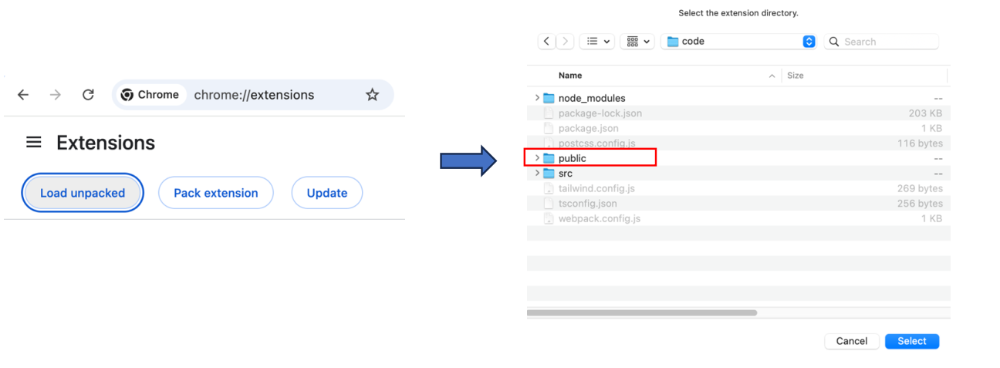
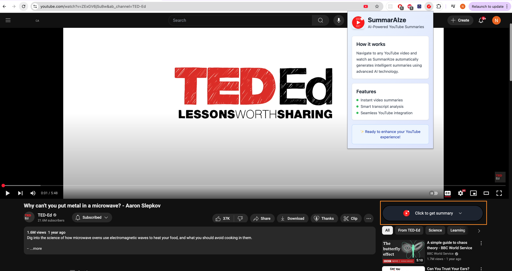
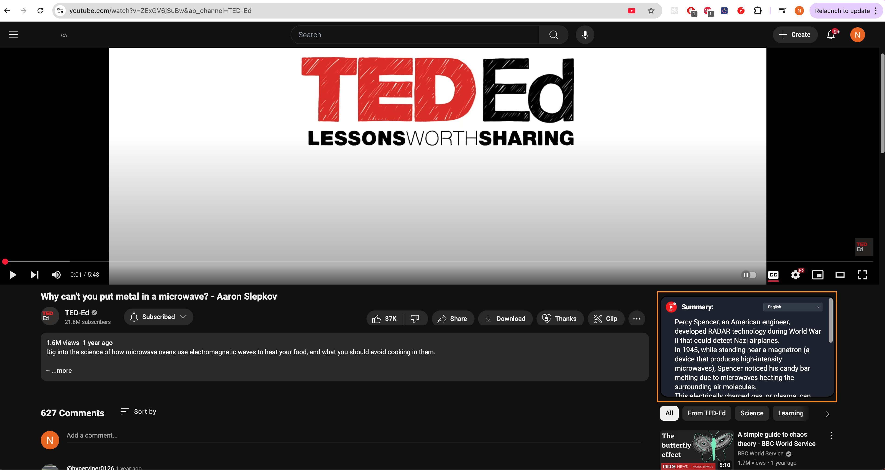

## SummarAIze - AI-Powered Youtube Video Summarizer

### Overview
SummarAIze is a Chrome extension that automatically generates intelligent summaries of YouTube videos using advanced AI technology. The extension extracts video transcripts and leverages large language models to create concise, bullet-point summaries that highlight the main topics and key insights from any YouTube video.

#### Features
- Auto-detects YouTube videos and grabs transcripts
- Works with any language that has captions
- Clean UI that fits right into YouTube
- Real-time processing as you navigate

### Technical Architecture

#### AI Models:
- OpenAI GPT-4o (implemented but not used in the current version)
- OpenRouter's Mistral 7B (free-tier for development)
- Hugging Face's Mistral-8x7B (free-tier for development)

#### Code Innovation:
Unlike other YouTube projects that use third-party libraries or scraping that is prone to 
breakage when YouTube changes their frontend, SummarAIze uses a custom-built solution that directly interacts 
with YouTube's InnerTube API (same one that powers their web player).

### Setup
#### You'll need:
- Node.js (v16+)
- API keys from Hugging Face or OpenRouter then add them to `.env` that you create in the root directory

#### Install:
```bash
npm install
npm run build
```
#### Add to Chrome:
1. Open Chrome and go to `chrome://extensions/`
2. Enable "Developer mode" in the top right corner
3. Click "Load unpacked" and select the `dist` folder





### What could be better
- **Stream**: Currently, the extension processes the entire transcript at once. The longer the transcript, the longer
the wait time. To improve UX, streaming the response in chunks will allow the extension to begin displaying the summary
while it's being received.
- **Longer Length Videos** The extention currently prepares the transcript before injectionm which could lead to longer
eait times for longer transcripts. There are limitations on tokens length for the free-tier models used in development 
(4096 for Mistral 7B and 8192 for Mistral-8x7B). And even for GPT-4o whose token limit is 128k tokens (input) and 
16,384 (output), there is also a possibility of exceeding the output limit. To address this, consider splitting the
transcript into smaller chunks to ensure requests stay within the token limits.
**Note**: These limits noted here arre not universal and depend on tier system and model provider.
- **Efficient DOM Monitoring**: The current implementation uses MutationObserver to monitor DOM changes, which can be 
resource-intensive as it observes all changes, including the unrelated ones. A more efficient approach would be to
use a more targeted approach, such as observing specific elements or monitoring URL changes directly using the popstate or pushState events could
reduce overhead and improve performance
- **API Key Management**: The API keys put in the frontend are visible and can be misused. To enhance security, consider
using a proxy API server that accepts request and relays them to the AI model.